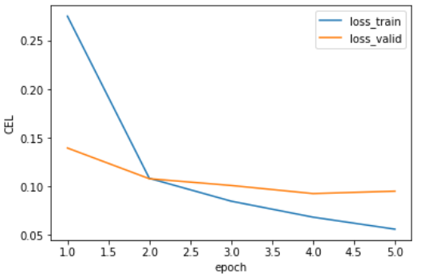
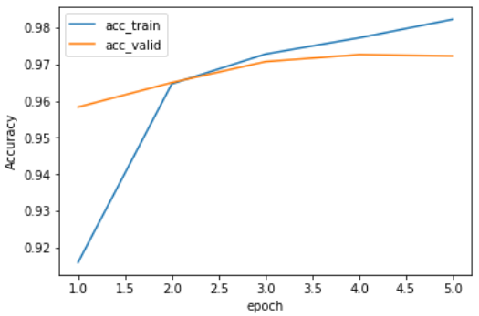
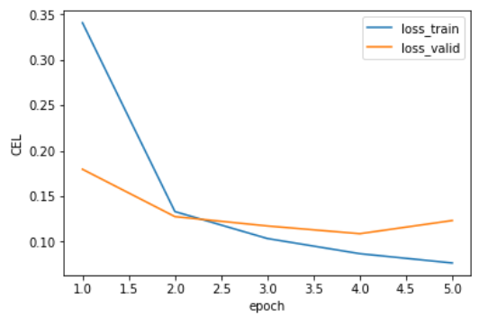
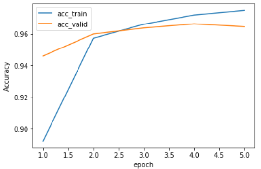
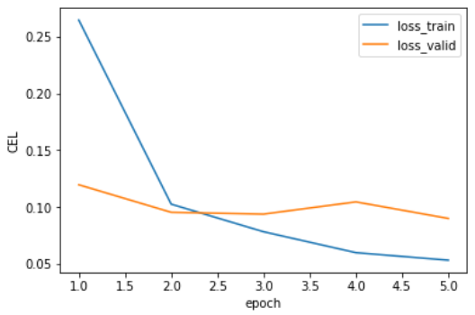
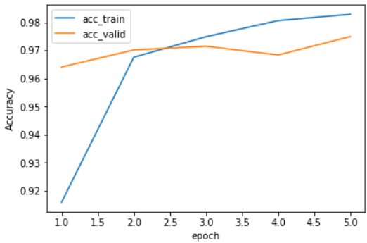

# 実験
各種設定を変更してみて学習の様子やPublicScoreがどう変わるかを検証

## ネットワークのアーキテクチャを変更
最適化アルゴリズム：Adam  
損失関数：CrossEntropyLoss  
固定のパラメータ
- epoch：5
- BATCH_SIZE：64

ネットワーク構成
1. Conv層：1->3->6　　Full層：216->100->10
1. Conv層：1->2->4　　Full層：144->100->10
1. Conv層：1->3->6　　Full層：216->100->50->10  
※kernelは全て(2,2)，strideは1

### 実験結果
1. Conv層：1->3->6　　Full層：216->100->10

    デフォルトのままだたと損失は単調減少，正答率は単調増加．  
    検証データの学習は3エポック程度でほとんど収束している．  
    Valid Loss: 0.0952  
    Valid Acc: 0.9723  
    PublicScore：　0.9690
    
    |損失|正答率|
    |---|---|
    |||

1. Conv層：1->2->4　　Full層：216->100->10

    畳み込み層で増やすチャンネル数を小さくすると，5エポック目で損失が増加．  
    検証データの正答率も低下．  
    Valid Loss: 0.1140  
    Valid Acc: 0.9657

    |損失|正答率|
    |---|---|
    |||

1. Conv層：1->3->6　　Full層：216->100->50->10

    全結合層の層を増やすと，検証データの正答率がわずかに増加．  
    Valid Loss: 0.0900  
    Valid Acc: 0.9749  
    Public Score: 0.9706

    |損失|正答率|
    |---|---|
    |||
    
結果：　PublicScore：　0.9690　→ 0.9706